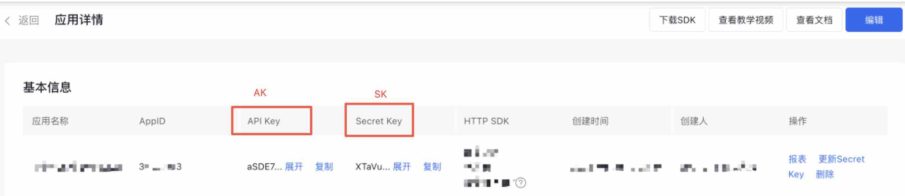

# Baidu Cloud ***CSharp SDK***
> 这是一个基于开源项目[***OpenAPI Generator***](https://openapi-generator.tech)生成的SDK，用于支持百度智能云产品提供的API调用，当前已支持的产品和接口参考[支持的产品](#supports-products)

## Supports & 使用
Frameworks支持以及包的安装参考[Nuget](https://www.nuget.org/packages/Baiducloud.SDK)

## Demo
以千帆大模型平台的接口为例
```csharp
using System;
using System.Collections.Generic;
using System.Threading.Tasks;
using Baiducloud.SDK.Api;
using Baiducloud.SDK.Client;
using Baiducloud.SDK.Client.Auth;
using Baiducloud.SDK.Model.Qianfan;

public class Demo
{
    public static void Main(string[] args)
    {
        Configuration config = new Configuration();
        // 设置鉴权
        config.SetAuth(new OAuth("your ak", "your sk"));
        var apiInstance = new QianfanApi(config);
        // 定义LLm
        var llm = new ChatLlm(ChatLlmEnum.ERNIE_Bot);
        // 定义请求
        var chatRequest = new ChatRequest(new List<ChatMessage>() { new ChatMessage(ChatMessageRole.User, "你好") });
        try
        {
            ChatResponse result = apiInstance.Chat(llm, chatRequest);
            Console.WriteLine(result.ToJson());
        }
        catch (ApiException e)
        {
            Console.WriteLine("Exception when calling QianfanApi.Chat: " + e.Message);
            Console.WriteLine("Status Code: " + e.ErrorCode);
            Console.WriteLine(e.StackTrace);
        }
    }
}
```

## 鉴权设置
鉴权类位于Baiducloud.SDK.Client.Auth命名空间下。
> 不是所有的接口都支持所有的鉴权方式，具体可以查看[支持的产品](#supports-products)的API章节
### OAuth
```csharp
// 初始化鉴权
IAuthentication authentication = new OAuth("your ak", "your sk");

// 设置默认ApiClient的鉴权
GlobalConfiguration.Instance.SetAuth(authentication);
var apiInstance = new QianfanApi();

// 或者 针对ApiClient设置鉴权
Configuration config = new Configuration();
config.SetAuth(authentication);
var apiInstance = new QianfanApi(config);
```
OAuth认证需要应用的ak、sk，下图以文字识别为例。


### IamAuth
```csharp
// 初始化鉴权
IAuthentication authentication = new IamAuth("your iamAk", "your iamSk");

// 设置默认ApiClient的鉴权
GlobalConfiguration.Instance.SetAuth(authentication);
var apiInstance = new QianfanApi();

// 或者 针对ApiClient设置鉴权
Configuration config = new Configuration();
config.SetAuth(authentication);
var apiInstance = new QianfanApi(config);
```
Iam认证需要使用账户的ak、sk，参考下图获取。


> 一个ApiClient可以设置多个鉴权，设置相同的ApiClient会进行覆盖，不同的鉴权优先生效最先配置的鉴权。接口也会根据自身支持的鉴权选择支持的鉴权进行调用。
## 接口调用
以千帆chat接口为例
### 同步调用
```csharp
// 直接获取返回结果
ChatResponse result = apiInstance.Chat(llm, chatRequest);

// 获取返回的Header等其他额外信息
ApiResponse<ChatResponse> result = apiInstance.ChatWithHttpInfo(llm, chatRequest);
int statusCode = result.StatusCode; //或者Http状态码
Multimap<string,string> headers = result.Headers; // 获取返回的Headers
ChatResponse response = result.Data;
```
### 异步调用
```csharp
// 不可取消的异步任务
var task = apiInstance.ChatAsync(llm, chatRequest);
task.Wait();
var result = task.Result;//同 var result = await apiInstance.ChatAsync(llm, chatRequest);
Console.WriteLine(result.ToJson());
```
#### 异步调用取消
> 任务终止能中断API请求，但是若API请求已经进入服务端计算阶段，仍然会产生计费。非SSE的接口不推荐使用异步中断，因为请求一旦到达服务端这并不会中断服务端的计算。
```csharp
using (var cancellationTokenSource = new CancellationTokenSource())
{
    var result = apiInstance.ChatAsync(llm, chatRequest, cancellationTokenSource.Token);
    cancellationTokenSource.Cancel();// 取消异步任务
}
```

## 自定义配置
```csharp
Configuration config = new Configuration();
var apiInstance = new QianfanApi(config);
```
### 代理
#### 网络代理
网络代理可以通过对OkHttpClient设置proxy参数实现，以下是一个简单的例子，复杂的代理配置可以查阅okhttp的文档。
```csharp
Configuration config = new Configuration();
System.Net.WebProxy webProxy = new System.Net.WebProxy("http://myProxyUrl:80/");
webProxy.Credentials = System.Net.CredentialCache.DefaultCredentials;
config.Proxy = webProxy;
```
#### 反向代理
反向代理可以通过修改base path来实现
> 使用需要了解反向代理的知识，推荐先通过postman等调试工具把反向代理配置调试通过

```csharp
Configuration config = new Configuration();
config.BasePath = "your proxy path";
var auth = new OAuth("your ak","your sk","your proxy path");//IAM鉴权类不支持反向代理，可自行实现IAuthentication接口，需要注意改写host和path
config.SetAuth(auth);
var apiInstance = new QianfanApi(config);
```

### Configuration 常用设置
```csharp
Configuration config = new Configuration();
config.Timeout = 300000;// 设置http超时时间
// 上述列了常用设置，一些不常用的设置，可根据源码自行探索。这些设置都可以通过自定义OkHttpClient实现。
```

### 模型初始化技巧
```csharp
// 反序列化构造
var chatRequest = JsonConvert.DeserializeObject<ChatRequest>("{\"messages\":[{\"role\":\"user\",\"content\":\"你好\"}],\"stream\":true}");
// 序列化
var jsonString = chatRequest.ToJson();
```

## 支持的产品
<a name="supports-products"></a>
[千帆大模型平台](QianfanREADME.md)