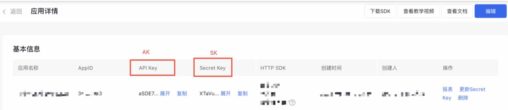

# Baidu Cloud ***JAVA SDK***
> 这是一个基于开源项目[***OpenAPI Generator***](https://openapi-generator.tech)生成的SDK，用于支持百度智能云产品提供的API调用，当前已支持的产品和接口参考[支持的产品](#supports-products)

## 使用
### Maven用户
```xml
<dependency>
  <groupId>io.github.baidubce</groupId>
  <artifactId>baiducloud-sdk</artifactId>
  <version>1.0.2</version>
  <scope>compile</scope>
</dependency>
```

### Gradle用户
```groovy
  repositories {
    mavenCentral()     // 使用Maven中央仓库
  }

  dependencies {
     implementation "io.github.baidubce:baiducloud-sdk:1.0.2"
  }
```

## Demo
以千帆大模型平台的接口为例
```java
import com.baiducloud.sdk.*;// 引入SDK的基础包
import com.baiducloud.sdk.auth.*;// 引入鉴权包
import com.baiducloud.sdk.model.qianfan.*;// 引入产品模型包
import com.baiducloud.sdk.api.QianfanApi;// 引入产品接口类

public class Example {
  public static void main(String[] args) {
    // 设置鉴权
    Authentication auth = new OAuth("your ak", "your sk");
    // 设置默认client鉴权
    Configuration.getDefaultApiClient().setAuth(auth);
    QianfanApi apiInstance = new QianfanApi();
    try {
      ChatLlm llm = new ChatLlm(ChatLlmEnum.ERNIE_Bot);
      // 设置body参数
      ChatRequest chatRequest = new ChatRequest().addMessagesItem(new ChatMessage().role(ChatMessageRole.USER).content("你好"));
      // 请求接口
      ChatResponse response = apiInstance.chat(llm, chatRequest);
      // 控制台输出结果
      System.out.println(response.toJson());
    } catch (ApiException e) {
      System.err.println("Exception when calling QianfanApi");
      System.err.println("Status code: " + e.getCode());
      System.err.println("Reason: " + e.getResponseBody());
      System.err.println("Response headers: " + e.getResponseHeaders());
      e.printStackTrace();
    }
  }
}
```

## 鉴权设置
鉴权类位于com.baiducloud.sdk.auth包下。
> 不是所有的接口都支持所有的鉴权方式，具体可以查看[支持的产品](#supports-products)的API章节
### OAuth
```java
// 初始化鉴权
Authentication auth = new OAuth("your ak", "your sk");

// 设置默认ApiClient的鉴权
Configuration.getDefaultApiClient().setAuth(auth); 
QianfanApi apiInstance = new QianfanApi();

// 或者 针对ApiClient设置鉴权
ApiClient apiClient = new ApiClient();
apiClient.setAuth(auth);
QianfanApi apiInstance = new QianfanApi(apiClient);
```
OAuth认证需要应用的ak、sk，下图以文字识别为例。


### IamAuth
```java
// 初始化鉴权
Authentication auth = new IamAuth("your iamAk", "your iamSk");

// 设置默认ApiClient的鉴权
Configuration.getDefaultApiClient().setAuth(auth); 
QianfanApi apiInstance = new QianfanApi();

// 或者 针对ApiClient设置鉴权
ApiClient apiClient = new ApiClient();
apiClient.setAuth(auth);
QianfanApi apiInstance = new QianfanApi(apiClient);
```
Iam认证需要使用账户的ak、sk，参考下图获取。


> 一个ApiClient可以设置多个鉴权，设置相同的ApiClient会进行覆盖，不同的鉴权优先生效最先配置的鉴权。接口也会根据自身支持的鉴权选择支持的鉴权进行调用。
## 接口调用
以千帆chat接口为例
### 同步调用
```java
// 直接获取返回结果
ChatResponse response = apiInstance.chat(llm, chatRequest);

// 获取返回的Header等其他额外信息
ApiResponse<ChatResponse> localVarResp = chatWithHttpInfo(llm, chatRequest);
int statusCode = localVarResp.getStatusCode(); //或者Http状态码
Map<String,List<String>> headers = localVarResp.getHeaders(); // 获取返回的Headers
ChatResponse response = localVarResp.getData();
```
### 异步调用
```java
ChatRequest chatRequest = new ChatRequest().addMessagesItem(new ChatMessage().role(ChatMessageRole.USER).content("你好"));
QianfanApi apiInstance = new QianfanApi();
okhttp3.Call call =  api.chatAsync(llm, chatRequest, new ApiCallback<ChatResponse>() {
    @Override
    public void onFailure(ApiException e, int statusCode, Map<String, List<String>> responseHeaders) {
        // 处理异常
    }

    @Override
    public void onSuccess(ChatResponse result, int statusCode, Map<String, List<String>> responseHeaders) {
        // 处理非流式返回的结果
        // SSE响应的接口也需要处理
    }

    @Override
    public void onSseStart(int statusCode, Map<String, List<String>> responseHeaders) {
        // 支持SSE的接口返回开始
    }

    @Override
    public void onSseData(ChatResponse data) {
        // SSE返回的单条数据
    }

    @Override
    public void onSseEnd() {
        // 支持SSE的接口返回结束时触发
    }
});
```
#### 异步调用取消
> 任务终止能中断API请求，但是若API请求已经进入服务端计算阶段，仍然会产生计费。非SSE的接口不推荐使用异步中断，因为请求一旦到达服务端这并不会中断服务端的计算。
```java
call.cancel(); // call是创建异步请求方法是的返回值
```

## 自定义OkHttpClient
```java
OkHttpClient client = new OkHttpClient.Builder().build();
ApiClient apiClient = new ApiClient(client);
```
### 代理
#### 网络代理
网络代理可以通过对OkHttpClient设置proxy参数实现，以下是一个简单的例子，复杂的代理配置可以查阅okhttp的文档。
```java
Proxy proxy = new Proxy(Proxy.Type.HTTP, new InetSocketAddress("代理服务器的主机名", 代理服务器的端口号));
OkHttpClient client = new OkHttpClient.Builder()
.proxy(proxy)
.build();
ApiClient apiClient = new ApiClient(client);
```
#### 反向代理
反向代理可以通过修改base path来实现
> 使用需要了解反向代理的知识，推荐先通过postman等调试工具把反向代理配置调试通过

```java
OAuth auth = new OAuth("your ak", "your sk", "反向代理地址");//IAM鉴权类不支持反向代理，可根据源码自行实现IAuthentication接口，需要注意改写host和path
QianfanApi apiInstance = new QianfanApi();
apiInstance.setCustomBaseUrl("反向代理地址");
```

### ApiClient设置
ApiClient中对OkHttpClient一些常用的设置进行了封装
```java
ApiClient apiClient = new ApiClient();
apiClient.setVerifyingSsl(false);// 禁用SSL校验
apiClient.setDebugging(true);// 开启OkHttp的调试模型
apiClient.setReadTimeout(1200000); // 设置读取超时时间
// 上述列了常用设置，一些不常用的设置，可根据源码自行探索。这些设置都可以通过自定义OkHttpClient实现。
```

### 模型初始化技巧
```java
// 链式构造
ChatRequest chatRequest = new ChatRequest().addMessagesItem(new ChatMessage().role(ChatMessageRole.USER).content("你好")).stream(true);
// 反序列化构造
ChatRequest chatRequest = ChatRequest.fromJson("{\"messages\":[{\"role\":\"user\",\"content\":\"你好\"}],\"stream\":true}");
// 序列化
String jsonString = chatRequest.chatRequest.toJson();
```

## 支持的产品
<a name="supports-products"></a>
[千帆大模型平台](QianfanREADME.md)