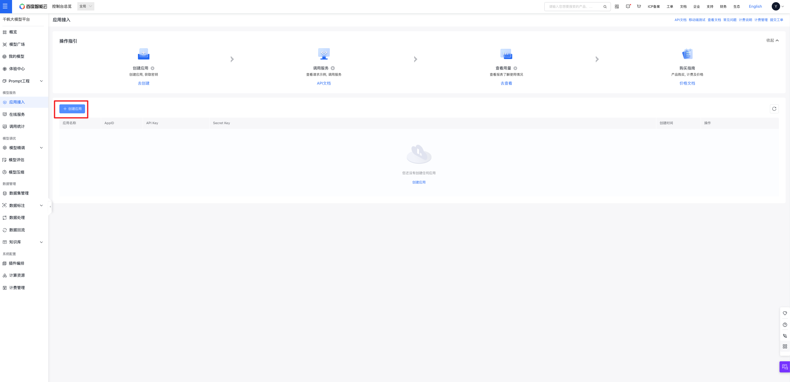
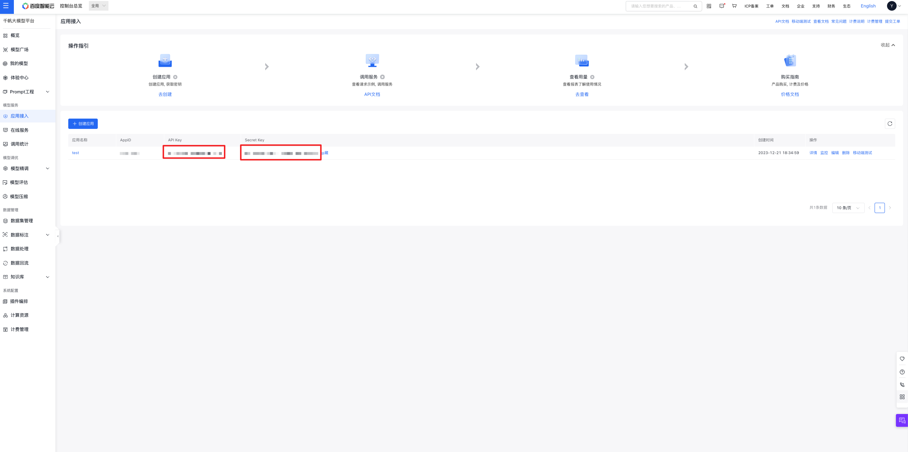
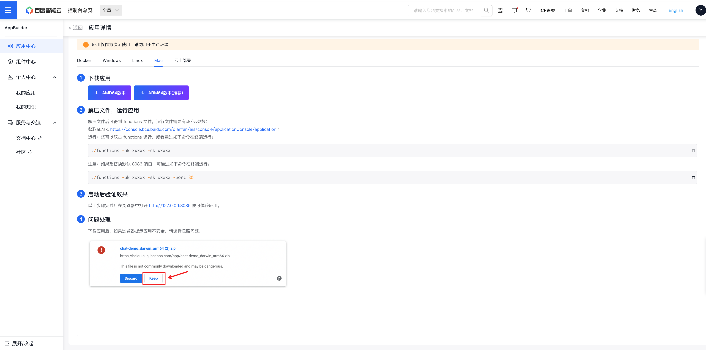

<div align="center">

<h1>百度智能云服务交付中心 - 示例样板间</h1>
<br/>


[](https://console.bce.baidu.com/tools/?u=bce-head#/sampleAppCenter/chat-demo)
[](https://cloud.baidu.com/doc/AppBuilder/s/Jlqa9qyot)

</div>

- [介绍](#介绍)
- [线上体验](#线上体验)
- [部署](#部署)
  - [准备 - API Key / Secret Key](#准备---api-key--secret-key)
  - [部署 - 可执行文件](#部署---可执行文件)
  - [部署 - 源码](#部署---源码)
    - [编译代码](#编译代码)
    - [运行代码](#运行代码)
    - [版本号](#版本号)
- [代码目录介绍](#代码目录介绍)
  - [前端代码](#前端代码)
  - [服务端代码](#服务端代码)
- [License](#license)


## 介绍
由百度智能云服务交付中心(SDC)出品的示例样板间『私域问答』，基于私有语料实现检索和推理，提供可控范围内的知识问答能力。

## 线上体验                     
您可以到[这里](https://console.bce.baidu.com/ai_apaas/appCenter/experience?url=https%3A%2F%2Fconsole.bce.baidu.com%2Ftools%2F%3Fheader%3Dhidden%26u%3DappBuilder%23%2FchatDemo%2Fchat-faq%3Fname%3D%E7%A7%81%E5%9F%9F%E9%97%AE%E7%AD%94&from=%2FappCenter%2Fb36941fe-6723-44db-93c1-f204821ef609%2Fdetail), 体验在线的示例应用。


## 部署
除了线上快速体验效果，您也可以将示例应用部署到您的环境内，再开始之前，需要您先准备好千帆大模型平台的API Key / Secret Key

### 准备 - API Key / Secret Key

到 [千帆大模型平台](https://console.bce.baidu.com/qianfan/ais/console/applicationConsole/application)，创建应用，并记下API Key, Secret Key



### 部署 - 可执行文件
您可以根据如下步骤，低成本的将示例应用部署到自己的环境里

1. 回到[应用详情页](https://console.bce.baidu.com/ai_apaas/appCenter/b36941fe-6723-44db-93c1-f204821ef609/detail?tabKey=package)，点击"离线下载"

2. 不同的应用，部署方式可能略有区别。请根据您的需求，选择对应的平台，按照画面上的指示完成部署。


### 部署 - 源码
除了直接使用编译好的二进制文件部署外，您也可以使用源码部署，源码部署需要您自行编译代码，但是可以更加灵活的修改代码，以满足您的需求。

#### 编译代码
执行如下命令，快速编译前后端代码。
```bash
make yarnBuild
# 如果未安装make，可直接执行 cd html/chat-demo/ && yarn install && yarn run build
make build
# 如果未安装make，可直接执行 go build -o bin/chat-demo
```

#### 运行代码
ak，sk参数填入前面准备的API Key / Secret Key
```bash
./chatDemo -ak {替换为您的ak} -sk {替换为您的sk}
```

#### 版本号
可通过 `./chatDemo -v` 查看版本号


## 代码目录介绍

### 前端代码
目录：`html/chat-demo`
```plain
├── build // 打包文件
├── src
│ ├── api  // 接口定义文件
│ ├── assets // 静态资源文件
│ ├── modules // 业务模块
│ ├── router // 路由配置
│ ├── App.js  // 应用入口文件
│ ├── index.js // 入口文件
├── config-overrides.js // webpack配置文件
```


### 服务端代码
```plain
├── main.go // 入口文件，包含路由配置
├── pkg // 公共包
│ ├── completion  // 大模型推理相关代码
│ ├── config // 配置文件
│ ├── controller // 控制器
│ ├── domain // 公共方法
```


## License
本项目遵循Apache-2.0开源协议。详见[LICENSE](LICENSE)文件。